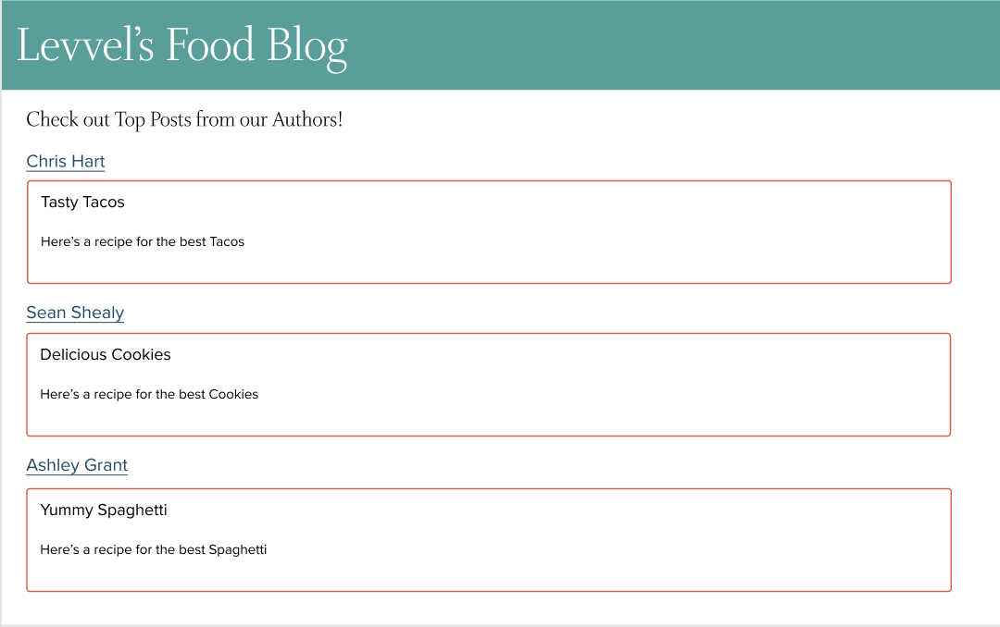
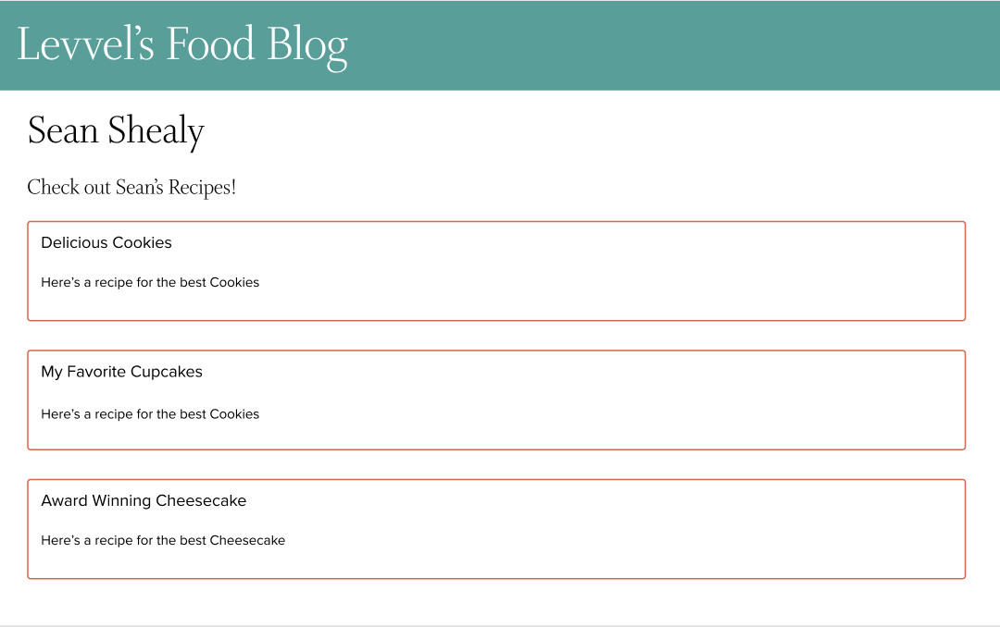

# Levvel Technical Interview

## Project Setup
- **Fork** the repository
- Clone the forked repository and open the project locally
- To run the project run the following command in the project directory:
`yarn start`
- Open [http://localhost:3000](http://localhost:3000) to view it in the browser.

[Help with Forking/Cloning](https://guides.github.com/activities/forking/)

## Task
Create a blog website that dynamically renders a list of sample blogs from different authors. The site should include, but is not limited to:
- A home page displaying the most popular blogs from each author
- An author page that displays all the blogs for a specific author.

The webpage may be designed any way that you would like. Feel free to modify existing files or create new files. You can add some new dependencies if you choose.

**Please spend no more than 4 hours on this task**

## Data
You should use this [JSON Placeholder API](https://jsonplaceholder.typicode.com/) to load the data for your webpage. 

## Resources
You may use any internet sources to aid your implementation. [React](https://reactjs.org/docs/getting-started.html) has great documentation if you get stuck/need help.

## Submitting Your Work (IMPORTANT)
When you are finished, create a Pull Request in Github for the forked repository. Email the link to your Pull Request to nicole.chini@levvel.io **at least 24 hours before your technical interview**

## Example Interfaces

Have fun :)